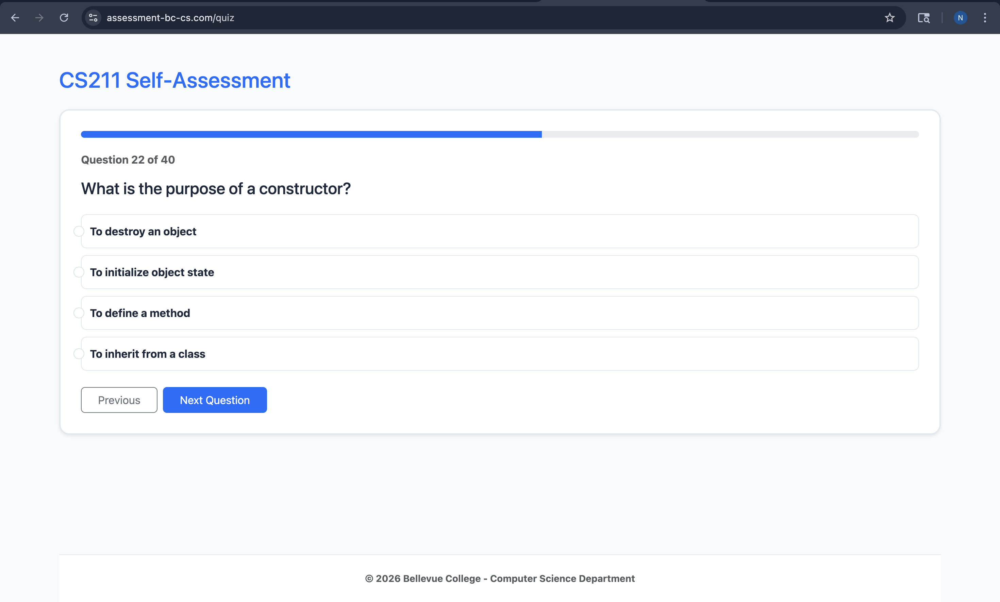
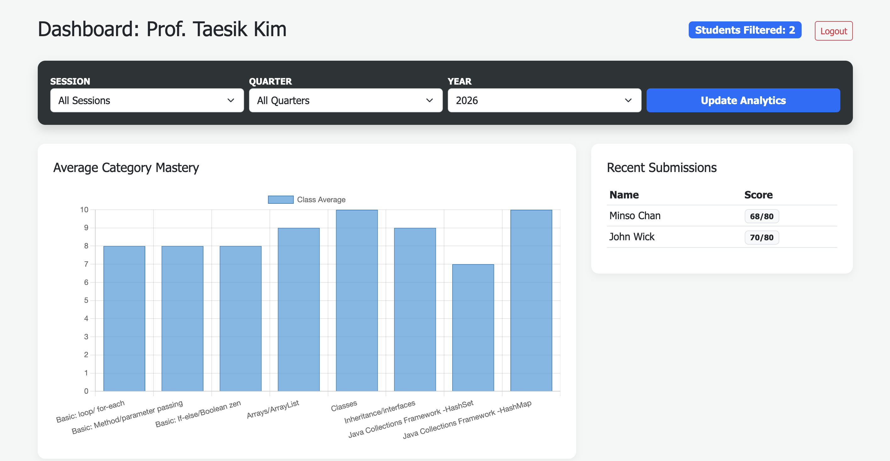
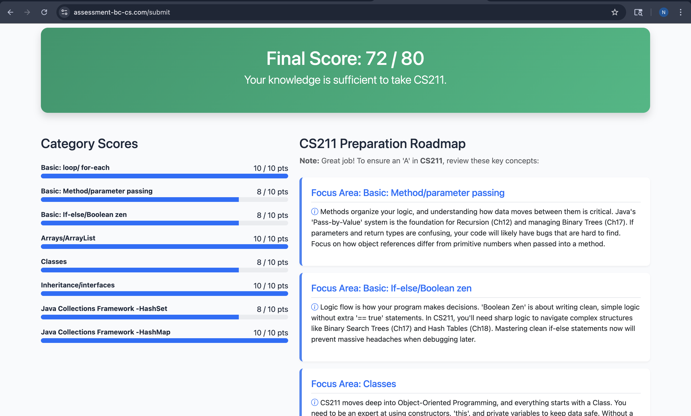

# CS211 Self-Assessment Tool

A web app that helps Bellevue College Computer Science students check their readiness for CS211 (Java) and gives instructors a live view of how a class is doing.

Students answer a short quiz across 8 Java topics. A machine learning model flags the topics they are weakest in and recommends what to study. Instructors log in to a dashboard that shows class averages and topic mastery.

Built for the Bellevue College Computer Science Department placement assessment program.



## What it does

**For students**
- Register with a Student ID, name, and course details. A welcome message explains how the assessment works.
- Take a multi-step quiz covering 8 core Java categories, including loops, OOP, collections, and interfaces.
- Get study recommendations based on the topics where they need the most practice.

**For instructors**
- Log in to a protected dashboard.
- See class averages and mastery for each topic.
- Filter results by quarter, session, and year.
- Review a table of recent submissions.



## How the recommendations work

1. Every attempt is saved to a MySQL database on AWS RDS.
2. The app loads past attempts with pandas and trains a **multi-output decision tree classifier** (scikit-learn) that predicts mastery for each topic at once.
3. When a student finishes the quiz, the model identifies their weak topics and returns study recommendations.

Because training uses the stored attempts, the model can improve as more students take the assessment.



## Data quality

- Student IDs must be exactly 9 digits. This is checked in the browser and again on the server, so bad input never reaches the database.
- Instructor-side filters clean up whitespace and letter case before matching, so "Fall", "fall", and " fall " all select the same data.
- Results are stored in AWS RDS (MySQL) as the source of truth. A secondary backup is also sent to Google Sheets.

## Tech stack

| Area | Tools |
|---|---|
| Backend | Python, FastAPI, Uvicorn |
| Database | AWS RDS (MySQL) |
| Machine learning | scikit-learn (decision tree), pandas |
| Frontend | Jinja2 templates, Bootstrap 5, JavaScript |
| Deployment | AWS App Runner (containerized) |

## Project structure

```
app.py             FastAPI app, routes, login, dashboard
logic.py           Assessment scoring and recommendation logic
questions.json     Quiz questions for the 8 Java topics
templates/         HTML templates
images/            Screenshots used in this README
requirements.txt   Python dependencies
```

## Run it locally

You need Python 3.9+ and access to a MySQL database.

```bash
git clone https://github.com/nyanlinaung-sys/cs211-self-assessment-project.git
cd cs211-self-assessment-project
python3 -m venv .venv
source .venv/bin/activate
pip install -r requirements.txt
```

Set your database settings as environment variables (do not commit them):

```bash
export DB_HOST=your_host
export DB_USER=your_user
export DB_PASS=your_password
export DB_NAME=your_database
```

Run the app:

```bash
python app.py
```

## Deploy on AWS App Runner

1. Allow inbound traffic on **port 3306** in the RDS security group from the App Runner service.
2. Add `DB_HOST`, `DB_USER`, `DB_PASS`, and `DB_NAME` to the App Runner service configuration.
3. The app is stateless. It uses `/tmp/` only for temporary model files, and the RDS database holds all permanent data.

## Possible improvements

- Report model accuracy on a held-out test set.
- Add charts for topic mastery trends across quarters.
- Add automated tests for scoring and validation logic.

## Author

Nyan Lin Aung | [GitHub](https://github.com/nyanlinaung-sys) | [Portfolio](https://nyanlinaung.com)
